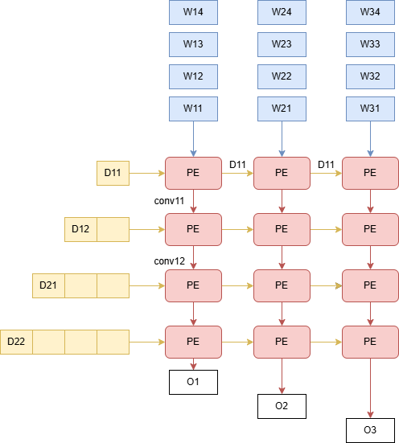

# 缓存控制

![[1]王兹哲.支持CNN扩展指令的RISC-V处理器研究与设计](img/im2col.png)

缓存需要输出一列数据给卷积单元，卷积单元通过不断的乘加得到结果，因此在卷积核输出时需要将这些输出重排。

本设计中每周期每个缓存行产生一个数据，因此第一周期会发送0,4,8,第二周期1,5,9,以此类推。

缓存中包含`kernel_idx_x`和`kernel_idx_y`两个信号，用于控制读取数据的位置。每次读取时会从[kernel_idx_y-1: kernel_idx_y - kernel_height]行读取数据。

输出的窗口也可以分为`kernel_height`行，每行的数量为`kernel_width`。并添加`window_idx`控制当前应填充第几列。因此填充过程为：根据`kernel_idx_y`从缓存中提取`kernel_height`个数据，放到输出窗口到第`window_idx`列。

当输出窗口填充满之后就要开始滑动，观察上面的示例可知窗口变化为数据左移一位并将获得的数据放在最后一列上。同理如果步长为2,那么窗口的每一行将左移两位并把新的数据放在倒数第二位上，公式为：

```
window_row = (window_row >> stride);
window_row[kernel_width-stride] = buffer_data;
```

为了处理填充，可以将kernel_idx_x和kernel_idx_y初始化为-padding，当其为负数时缓存读取数据为0,而当二者大于设定的缓存大小时同样输出为0。

# 卷积单元



卷积操作实际上是一个将数据与权重相乘并累加的过程。谷歌的TPU使用脉动阵列来计算卷积。脉动阵列是一个二维的处理单元网络，网络中的每个节点仅可以和相邻节点传递数据。这种结构容易扩展并且拥有较高的频率，但是他并不能节省资源

假设使用2x2的滑动窗口，现在输出数据D11-D22,按照图中所示形式进行摆放。PE中包含一个乘法器和一个加法器。权重数据在初始化时便位于每个PE中。每一列代表一个卷积核。

第一周期D11和W11在PE0,0中相乘，得到结果conv11,并将D11传递到下一列。

第二周期数据右移一位,D12和W12相乘，并加上conv11得到conv12。于此同时D11和W21在PE0,1中相乘得到conv21.

最终O1是卷积核1和窗口数据乘累加结果，即`D11*W11+D12*W12+D13*W13+D14*W14`

